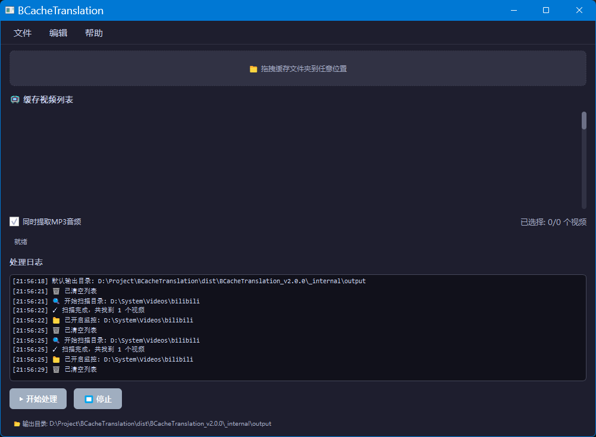

<div align="center">

# 🎬 BCacheTranslation

[](https://github.com/clehj/BCacheTranslation/releases)
[](https://github.com/clehj/BCacheTranslation/releases)
[](LICENSE)
[](https://www.python.org/)
[](https://www.riverbankcomputing.com/software/pyqt/)

**B站客户端缓存视频提取转换工具**

[下载](https://github.com/clehj/BCacheTranslation/releases) •
[功能](#-功能) •
[使用说明](#-使用说明) •
[构建](#-构建) •
[许可证](#-许可证)

</div>

---

B站客户端缓存视频提取转换工具。自动识别 Bilibili 客户端缓存目录中的 `.m4s` 文件，去除前导零字节填充，通过内置 ffmpeg 重新编码并合并为标准 MP4 文件，支持批量处理和 MP3 音频单独提取。

## ✨ 功能

- **自动扫描缓存**：自动检测 Windows 下 B 站客户端默认缓存目录，支持手动拖放文件夹
- **解析视频信息**：读取 `videoInfo.json` 获取标题、时长等元数据，展示封面缩略图
- **宫格预览**：以卡片流式布局展示所有缓存视频，双击查看详情，单击选中
- **文件清理**：去除 B 站 `.m4s` 缓存文件的前导零字节填充
- **格式转换**：内置 ffmpeg，将视频重编码为 H.264，音频重编码为 MP3，最终合并为 MP4
- **MP3 提取**：可单独提取音频为 MP3 文件
- **批量处理**：支持多选视频批量转换，后台线程执行，可随时停止
- **实时监控**：监听缓存目录变化，自动检测新下载的视频
- **暗色主题**：内置 Catppuccin Mocha 风格暗色主题
- **设置持久化**：自动保存用户偏好（输出目录、MP3 提取选项等）

## 📥 下载

### 方式一：安装包（推荐）

下载 `BCacheTranslation_Setup_2.0.0.exe`，按向导完成安装。可选项包括创建桌面快捷方式和开始菜单快捷方式。

### 方式二：便携版

下载 `BCacheTranslation_v2.0.0.zip`，解压后双击 `BCacheTranslation_v2.0.0.exe` 即可运行，所有配置保存在程序目录下。

## 📸 截图

<div align="center">
  
  <br>
  <em>主界面 - 暗色主题</em>
</div>

## 📖 使用说明

1. 启动程序后会自动扫描默认 B 站缓存目录（通常在 `Videos\bilibili` 下）
2. 也可将缓存文件夹（或包含 `.m4s` 文件的父目录）直接拖入拖放区域
3. 扫描到的视频将以卡片形式展示在宫格中，包含封面图和基本信息
4. 单击卡片选中/取消选中，双击查看详细信息
5. 在设置面板中可选择是否同时提取 MP3 音频
6. 点击「开始处理」按钮，对选中的视频进行批量转换
7. 转换完成的 MP4/MP3 文件将输出到指定目录（默认为程序目录下的 `output/` 文件夹）
8. 程序会自动监听缓存目录，有新视频下载时自动刷新列表

## 🔧 构建

### 打包为独立 EXE

```bash
python build.py
```

### 创建安装程序

```bash
build_installer.bat
```

需要预先安装 [Inno Setup 6](https://jrsoftware.org/isinfo.php)。

## 📁 项目结构

```
BCacheTranslation/
├── main.py                # 程序入口，全局异常处理
├── core.py                # 核心逻辑：缓存扫描、文件清理、ffmpeg 转换
├── version.py             # 版本信息
├── logger.py              # 调试日志
├── settings_manager.py    # 用户设置读写
├── style_manager.py       # 主题样式管理
├── ffmpeg/                # 内置 ffmpeg（已包含）
│   └── ffmpeg.exe
├── gui/                   # GUI 模块
│   ├── main_window.py     # 主窗口
│   ├── video_card.py      # 视频卡片组件
│   ├── drop_area.py       # 拖放区域
│   ├── flow_layout.py     # 流式布局
│   ├── log_area.py        # 日志输出
│   ├── menu_bar.py        # 菜单栏
│   ├── settings_panel.py  # 设置面板
│   ├── workers.py         # 后台线程
│   ├── constants.py       # 常量定义
│   └── utils.py           # 辅助函数
├── build.py               # PyInstaller 打包脚本
├── build_installer.bat    # Inno Setup 编译批处理
├── installer.iss          # Inno Setup 安装程序配置
├── setup.py               # Python 包配置
├── requirements.txt       # Python 依赖列表
├── settings.json          # 默认用户设置
└── style_config.json      # 主题配置
```

## 🛠️ 技术栈

| 模块 | 说明 |
|---|---|
| PyQt5 5.15 | GUI 框架，Fusion 风格 |
| ffmpeg | 视频/音频转码后端（已内置） |
| PyInstaller 6.x | 打包为独立 EXE |
| Inno Setup 6 | Windows 安装程序生成 |

## ❓ 常见问题

**Q: 为什么有些视频转换后没有声音？**  
A: 如果视频本身没有独立音频轨，程序会自动处理。若视频文件包含音频轨，程序会直接复制音频流。

**Q: 处理大视频时 CPU 占用很高？**  
A: 视频转码是计算密集型任务，属于正常现象。

**Q: 杀毒软件报毒？**  
A: PyInstaller 打包的程序可能被误报，添加信任即可。源码已在 GitHub 开源，可自行审查。

## 👥 关于本项目

本工具由 **clehj** 主导开发并发布。

在开发过程中，部分代码实现得到了 AI 辅助编程工具的建议和协助。

项目思路、功能设计、测试反馈及发布维护均由 **clehj** 独立完成。

## 📄 许可证

MIT License © 2024 clehj. 详见 [LICENSE.txt](LICENSE.txt)。

---

<div align="center">
  <sub>Built with ❤️ by clehj</sub>
</div>